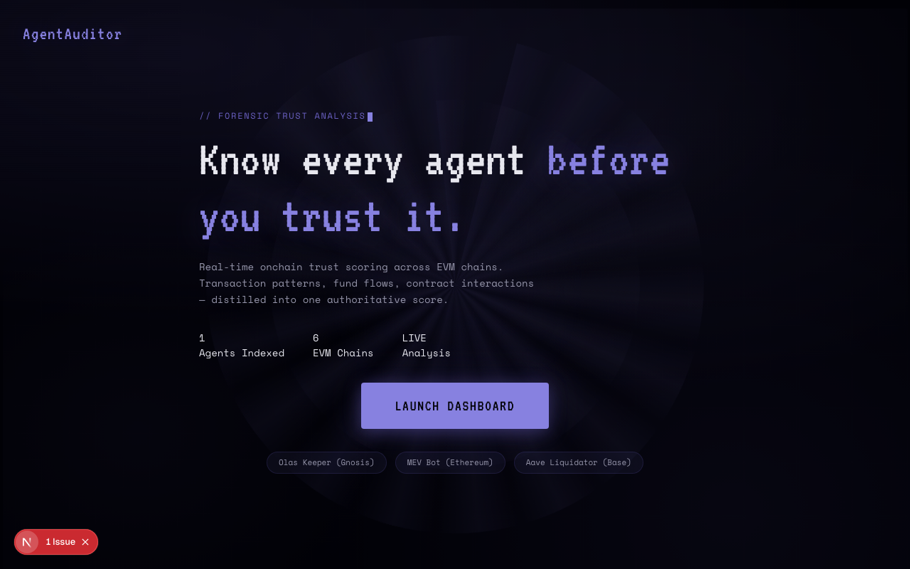

# AgentAuditor: Real-Time Trust Scoring for Onchain AI Agents

**🥈 Winner — GoldRush Agentic Track, Trends.fun Hackathon 2026**

[]()

Forensic trust intelligence for autonomous agents operating across EVM chains and Solana. Analyzes transaction patterns, fund flows, and contract interactions to produce a 0-100 trust score with on-chain attestations.

[](https://www.typescriptlang.org/)
[](https://nextjs.org/)
[](https://soliditylang.org/)
[](LICENSE)



## Live Demo

**[agent-auditor-solana.vercel.app](https://agent-auditor-solana.vercel.app)**

Paste any agent address, ERC-8004 Agent ID, or agent name. Select a chain (or scan all 7 including Solana). Get a trust score in seconds.

---

## What Is AgentAuditor?

Autonomous AI agents are transacting onchain with real funds, but there's no way to verify whether an agent is trustworthy before interacting with it. AgentAuditor solves this by pulling transaction history from Blockscout, running behavioral analysis across 9 dimensions, scoring trust via LLM evaluation (Venice AI), and publishing the result as an on-chain attestation via ERC-7506.

---

## Features

- **Multi-chain scanning** across Base, Gnosis, Ethereum, Arbitrum, Optimism, Polygon, and Solana
- **Smart input detection** for addresses, ERC-8004 Agent IDs, registry names, and ENS
- **9-dimension behavioral profiling** covering activity breakdown, timezone fingerprinting, token flows, counterparty analysis, and protocol loyalty
- **LLM-powered trust scoring** via Venice AI with structured 4-axis breakdown (transaction patterns, contract interactions, fund flow, behavioral consistency)
- **On-chain attestations** recorded via ERC-7506 Reputation Registry
- **Autonomous scanner loop** that discovers new agents from ERC-8004 and Olas registries, audits them automatically, and sends Telegram alerts for non-SAFE agents
- **Telegram bot** with `/audit` command for mobile-friendly trust checks
- **Wallet classification** distinguishing EOA vs contract, human vs agent probability scoring

---

## Tech Stack

| Layer | Technology |
|-------|-----------|
| Frontend | Next.js 16, React 19, Tailwind v4, Framer Motion |
| Backend | Next.js API routes, TypeScript 5.8 |
| Blockchain | Viem 2.47, Solidity 0.8.24 (Foundry) |
| AI | Venice AI (llama-3.3-70b via OpenAI SDK) |
| Bot | grammy 1.41 (Telegram) |
| Data | Blockscout API (EVM), Helius Enhanced Transactions (Solana), Covalent GoldRush (Solana balances), ERC-8004 Identity Registry, Olas Service Registry |
| Deploy | Vercel (web), Render (bot worker) |

---

## Testing the App

### Web Interface

1. Open the landing page and click **Launch Dashboard**
2. Paste an agent address into the input field (or click one of the example agents)
3. Select a chain from the dropdown, or leave "All Chains" to scan everywhere
4. Review the trust score card: overall score (0-100), 4-axis breakdown, behavioral narrative, flags, and recommendation (SAFE / CAUTION / BLOCKLIST)
5. Scroll down for the transaction table showing the first 20 transactions with decoded method labels

### Telegram Bot

1. Find the bot on Telegram (configured via `TELEGRAM_BOT_TOKEN`)
2. Send `/audit 0x77af31De935740567Cf4fF1986D04B2c964A786a gnosis` to audit an Olas Keeper
3. Send `/audit 0x6b75d8AF000000e20B7a7DDf000Ba900b4009A80 ethereum` to audit a MEV bot
4. Send `/status` to check if the autonomous scanner is running

### Example Agents to Try

| Agent | Address | Chain |
|-------|---------|-------|
| Olas Keeper | `0x77af31De935740567Cf4fF1986D04B2c964A786a` | Gnosis |
| MEV Bot | `0x6b75d8AF000000e20B7a7DDf000Ba900b4009A80` | Ethereum |
| Aave Liquidator | `0x80D4e3d92B4AA394b1B58cB568a6e2DE0FE2698E` | Base |

---

## API Reference

| Method | Endpoint | Description |
|--------|----------|-------------|
| POST | `/api/analyze` | Analyze an agent by address, Agent ID, or name. Returns trust score, behavioral profile, transactions, wallet classification |
| GET | `/api/directory` | List pre-seeded known agents with scores and metadata |

### POST `/api/analyze`

```json
{
  "input": "0x77af31De935740567Cf4fF1986D04B2c964A786a",
  "chain": "gnosis"
}
```

Input accepts: hex address, ERC-8004 Agent ID, registered agent name, or ENS name. Chain accepts: `base`, `gnosis`, `ethereum`, `arbitrum`, `optimism`, `polygon`, or `all`.

---

## Smart Contracts

| Contract | Address | Network |
|----------|---------|---------|
| AgentBlocklist | `0x1E3ba77E2D73B5B70a6D534454305b02e425abBA` | Base Sepolia |

The AgentBlocklist contract maintains an owner-controlled registry of flagged agent addresses. Public `isBlocked(address)` reads, owner-only `blockAgent` / `unblockAgent` / `blockAgentsBatch` writes.

---

## How It Works

```
User Input (address / Agent ID / name)
  |
  v
Input Detection + Resolution
  |
  +---> Blockscout API ---------> Transaction History
  |                                    |
  +---> ERC-8004 Registry ------> Agent Identity
  |                                    |
  +---> Olas Registry ----------> Service Metadata
  |                                    |
  v                                    v
Behavioral Profile Engine       9-Dimension Analysis
  |
  v
Venice AI (LLM Trust Scoring)
  |
  +---> Trust Score (0-100) + 4-axis breakdown
  |
  +---> On-chain Attestation (ERC-7506)
  |
  +---> Telegram Alert (if non-SAFE)
```

### Autonomous Loop (Background Worker)

```
Cron (every 5 min)
  |
  v
Chain Scanner (6 chains)
  |
  +---> ERC-8004 Discovery ----> New agent registrations
  |
  +---> Olas Discovery --------> New service registrations
  |
  v
Auto-Audit Pipeline
  |
  +---> Blockscout fetch
  +---> Venice AI analysis
  +---> On-chain attestation
  +---> Telegram alert (non-SAFE only)
```

---

## Running Locally

```bash
git clone https://github.com/dmustapha/agent-auditor.git
cd agent-auditor

# Install dependencies
npm install

# Copy env file and fill in values
cp .env.example .env

# Run the web app
npm run dev

# In a separate terminal, run the autonomous scanner + Telegram bot
bun run loop
```

### Required Environment Variables

| Variable | Description |
|----------|-------------|
| `VENICE_API_KEY` | API key from venice.ai |
| `PRIVATE_KEY` | Wallet private key for on-chain attestations |
| `BLOCKLIST_CONTRACT_ADDRESS` | Deployed AgentBlocklist contract address |
| `NEXT_PUBLIC_USE_TESTNET` | `true` for testnet, `false` for mainnet |

### Optional Environment Variables

| Variable | Description |
|----------|-------------|
| `TELEGRAM_BOT_TOKEN` | Telegram bot token from BotFather |
| `TELEGRAM_CHANNEL_ID` | Telegram channel for autonomous alerts |
| `LOOP_INTERVAL_MS` | Scanner interval in ms (default: 300000 = 5 min) |
| `VENICE_MOCK` | Set `true` to skip AI calls during development |

---

## Project Structure

```
src/
  app/
    api/
      analyze/route.ts     # Core analysis endpoint
      directory/route.ts    # Agent directory endpoint
    components/             # React UI components
    page.tsx                # Single-page application root
  bot/
    telegram.ts             # Telegram bot commands and handlers
  lib/
    behavioral-profile.ts   # 9-dimension behavioral analysis
    blockscout.ts           # Transaction data fetching
    chains.ts               # Chain configs, registry addresses
    erc8004.ts              # ERC-8004 identity registry client
    loop.ts                 # Autonomous scanner loop
    olas-discovery.ts       # Olas service registry client
    trust-score.ts          # Score computation and formatting
    venice-client.ts        # Venice AI (OpenAI SDK) client
    agent-classifier.ts     # Method-level agent type detection
    types.ts                # Shared TypeScript types
  scripts/
    run-loop.ts             # Loop + bot entry point
    register-agent.ts       # ERC-8004 agent registration
    seed-test-agents.ts     # Test data seeder
contracts/
  src/AgentBlocklist.sol    # On-chain agent blocklist
```

---

## License

MIT
